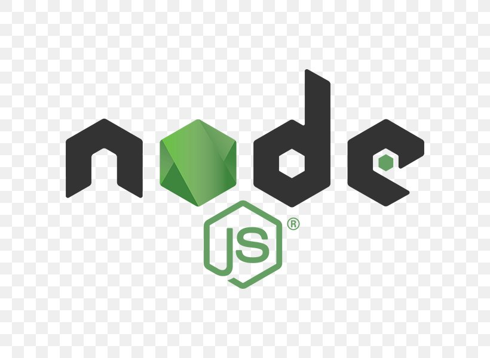
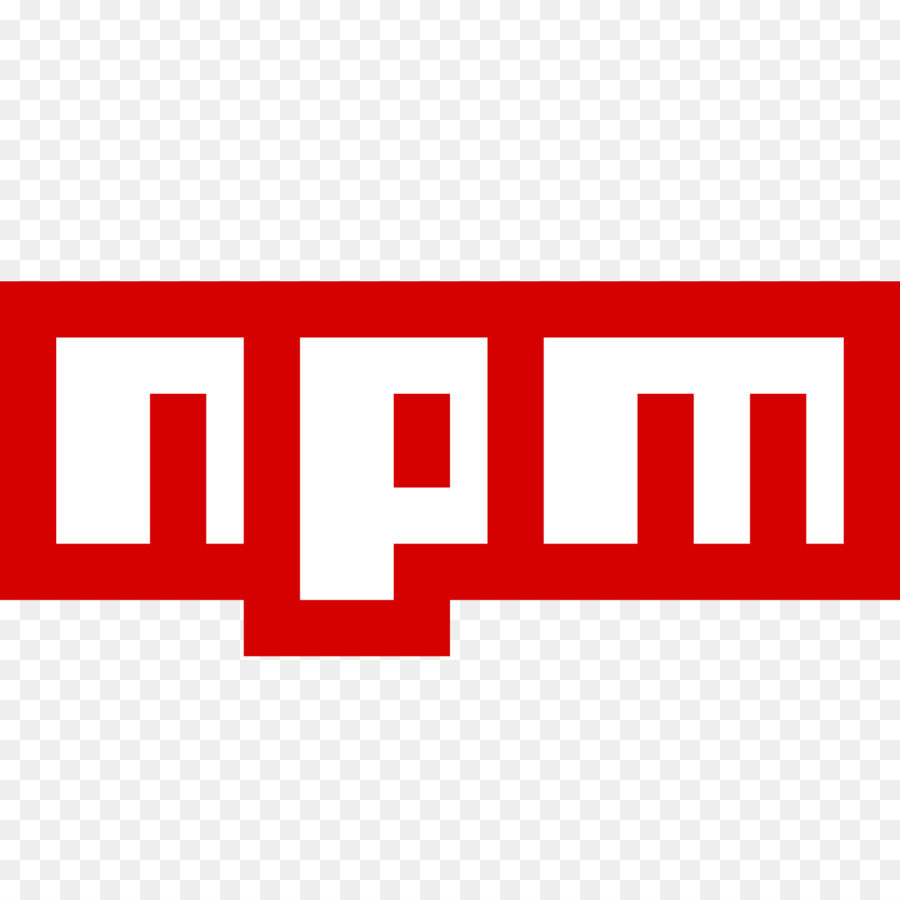
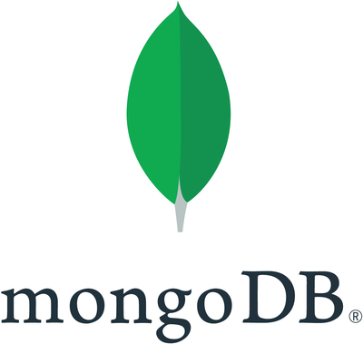
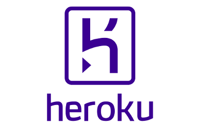
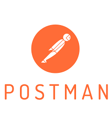

<!--
**jinnatul/jinnatul** is a ✨ _special_ ✨ repository because its `README.md` (this file) appears on your GitHub profile.
Here are some ideas to get you started:
- 🔭 I’m currently working on ...
- 🌱 I’m currently learning ...
- 👯 I’m looking to collaborate on ...
- 🤔 I’m looking for help with ...
- 💬 Ask me about ...
- 📫 How to reach me: ...
- 😄 Pronouns: ...
- ⚡ Fun fact: ...
--->

## Hi there, I'm [Morol](https://aboutmorol.herokuapp.com/) 👋
A passionate Software Developer 🚀 and content writer ✍.

### Languages and Tools: 🔥

- **Languages**: 

  <code></code> 
  <code></code>
  <code></code>

- **Back-end**

  <code></code>
  <code></code>
  <code></code>

- **Front-end**
 
  <code></code>
  <code></code>
  <code></code>

- **Databases**  

  <code></code>
  <code></code>

- **Cloud & Open Source**  
  <code></code>
  <code></code>

- **Tools**

  <code></code>
  <code></code>

